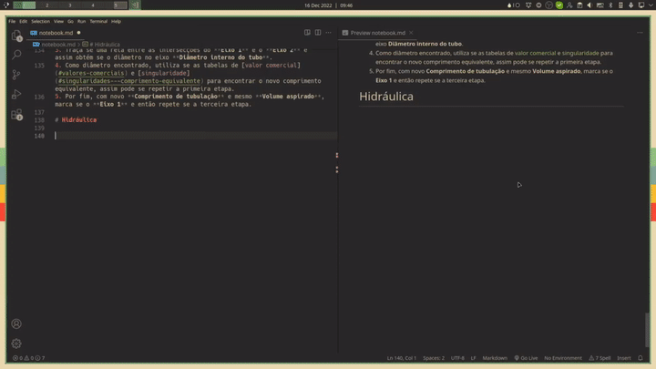

# super-figure
Super figure is a vscode extension that implements integration for Inkscape and Gimp as means to quickly launch and edit figures and see the results is your Latex or Markdown files.

This extension is inspired by the work of [Gilles Castel](https://castel.dev/post/lecture-notes-2/) and his [Vim plugin](https://github.com/gillescastel/inkscape-figures). May his blog not had a good SEO, i wouldn't have found it and had this idea, unfortunately he passed away in July 2022, so i'm dedicating this work to him as a thanks and to show that even in our passing, our work will continue to inspire others and move knowledge and human kind forwards, because we stand on the shoulder's of giants, rest in peace Gilles.

# Features

This extension enables you to launch image files from Latex or Markdown directly into a external image editor, like Inkscape and Gimp, for that just select the text and open the command palette with `ctrl+shift+p`, then search for `super figure`, a list of commands will be shown.

Some key features:
* Edit file externally with a simple command just by selecting the filepath!
* Files will be crated based on a template if they not exist yet
* Ready to go snippets for Latex and Markdown via commands
* onSave commands for when extra work is needed after editing the file. Ex: Saving `svg` files to `pdf` and `tex` for latex.
* Image file renaming
* Keybindings

>Sample using Latex and Inkscape:


>Sample using Markdown and Gimp:


# TOC
- [super-figure](#super-figure)
- [Features](#features)
- [TOC](#toc)
- [Usage](#usage)
	- [TLDR](#tldr)
	- [Key bindings](#key-bindings)
	- [Configuration](#configuration)
	- [Template file](#template-file)
	- [On save commands](#on-save-commands)
		- [Inkscape](#inkscape)
		- [Gimp](#gimp)
- [FAQ](#faq)
- [Commands](#commands)
	- [Edit Figure (`super-figure.editFigure`)](#edit-figure-super-figureeditfigure)
	- [Rename figure (`super-figure.renameFigure`)](#rename-figure-super-figurerenamefigure)
	- [Edit Figure based on the file extension (`super-figure.editFigureExtension`)](#edit-figure-based-on-the-file-extension-super-figureeditfigureextension)
	- [Edit Vector figure (`super-figure.editVector`)](#edit-vector-figure-super-figureeditvector)
	- [Edit Bitmap figure (`super-figure.editBitmap`)](#edit-bitmap-figure-super-figureeditbitmap)
	- [Insert vector figure as latex snippet (`super-figure.insertLatexVectorFigure`)](#insert-vector-figure-as-latex-snippet-super-figureinsertlatexvectorfigure)
	- [Insert bitmap figure as latex snippet (`super-figure.insertLatexBitmapFigure`)](#insert-bitmap-figure-as-latex-snippet-super-figureinsertlatexbitmapfigure)
	- [Insert Latex Preamble (`super-figure.insertLatexPre`)](#insert-latex-preamble-super-figureinsertlatexpre)
	- [Insert vector figure as markdown snippet (`super-figure.insertMarkdownVectorFigure`)](#insert-vector-figure-as-markdown-snippet-super-figureinsertmarkdownvectorfigure)
	- [Insert bitmap figure as markdown snippet (`super-figure.insertMarkdownBitmapFigure`)](#insert-bitmap-figure-as-markdown-snippet-super-figureinsertmarkdownbitmapfigure)
- [Requirements](#requirements)
	- [Windows](#windows)
	- [Archlinux (and based systems)](#archlinux-and-based-systems)
- [Extension Settings](#extension-settings)
	- [Variables](#variables)
	- [List (as is)](#list-as-is)
- [Known Issues](#known-issues)
- [Planned Features](#planned-features)
- [Release Notes](#release-notes)
	- [1.0.2](#102)
	- [1.0.1](#101)
	- [1.0.0](#100)

# Usage

## TLDR

Super figure should fully work out the box if you have Inkscape and Gimp installed on Windows or Linux! 

For common problems go to [the FAQ](#faq).

For detailed configuration info, go to [Configuration](#configuration).

For a quick setup config if your don't work, try this. After installing the extension, press `ctrl+shift+p`, then type/search for `Preferences: Open Settings (UI)`, look on the left for the `Extensions` dropdown, then scroll until you find `Super Figure`, click it, then you need to alter:

* `Bitmap Figure Editor`: The full path to your bitmap edit tool, like Gimp or Photoshop
* `Vector Figure Editor`: The full path to your vector edit tool, like Inkscape or Corel

In case of more complicated and mysterious problems, just create a new [issue report here](https://github.com/Joao-Peterson/super-figure/issues).

## Key bindings

Two default keybindings are defined, for vector and bitmap editing, both work in latex and markdown and execute the corresponding command to the language.

* `ctrl+alt+v`: Insert Vector figure
* `ctrl+alt+b`: Insert Bitmap figure
* `ctrl+alt+r`: Rename figure

## Configuration

Every configuration is set by default, but it may not work out of the box for you, for that i recommend that you set first:

The executables full path and their arguments to launch the figures correctly:
* `super-figure.vectorFigureEditor`
* `super-figure.vectorFigureEditorArgs`
* `super-figure.bitmapFigureEditor`
* `super-figure.bitmapFigureEditorArgs`

See also [Variables](#variables) for more info.

After this i also recommend you to configure the `onSave` commands, because every figure created/modified by the extension is watched and emits an event everytime you save the figure in the external editor, this can be used to trigger conversion events. See [On Save commands](#on-save-commands).

## Template file

After installed the extension provides the folder `super-figure/templates`, under the home folder, this folder contains templates for `svg`, `xcf` and `png` files, that will be suggested to you when creating new files, so if you need more templates, just add them to this folder and change the preferred ones in the config file. See `super-figure.vectorTemplate` and `super-figure.bitmapTemplate` under [Configurations List](#list-as-is).

Folder location:

* Windows
  * `C:Users\your_user\.config\super-templates\templates\`

* Linux
  * `~\.config\super-templates\templates\`

## On save commands

### Inkscape

For Inkscape, using the vector edit commands, `svg` files will be created, but latex doesn't use `svg` files, latex uses `pdf` files converted every time the `svg` is saved.

A nice feature here is that any text box you include in Inkscape, and has a tex math sequence, `$math$` or `\[math\]`, will be rendered by latex as typeset math text, not embedded in the image, but as a overlay os native text over the image.

```json
"super-figure.onVectorFileSave": "${executable} ${file} --export-area-page --export-dpi 300 --export-type=pdf --export-latex --export-filename ${dir}/${basename}.pdf"
```

For better visualization:
```js
`
${executable} ${file} 
--export-area-page 
--export-dpi 300 
--export-type=pdf 
--export-latex 
--export-filename ${dir}/${basename}.pdf
`
```

Here, everytime Inkscape saves the file, the extension listens to the event and executes the provided command, that also uses Inkscape, to generate a latex friendly `pdf`. This way, after the `onSave` command was executed, two files are generated:

* `images/figure.svg`
* `images/figure.pdf`
* `images/figure.pdf_tex`

Credits: [Gilles Castel](https://github.com/gillescastel/inkscape-figures/blob/master/inkscapefigures/main.py#L154)

### Gimp

Gimp also does takes advantage of this, by using the batch preprocessor, the friendly editable `.xcf` files are exported to `png` ones, for insertion into latex and markdown.

```json
"super-figure.onBitmapFileSave": "${executable} -n -i -b '(let* ( (filename \"${file}\") (fileout \"${dir}/${basename}.png\") (image 0) (layer 0) ) (set! image (car (gimp-file-load RUN-NONINTERACTIVE filename filename))) (set! layer (car (gimp-image-merge-visible-layers image CLIP-TO-IMAGE))) (gimp-file-save RUN-NONINTERACTIVE image layer fileout fileout) (gimp-image-delete image) (gimp-quit 0))'"
```

For better visualization:
```clojure
(let* 
	( 
		(filename "${file}") 
		(fileout "${dir}/${basename}.png") 
		(image 0) 
		(layer 0)
	) 
	(set! image (car (gimp-file-load RUN-NONINTERACTIVE filename filename))) 
	(set! layer (car (gimp-image-merge-visible-layers image CLIP-TO-IMAGE))) 
	(gimp-file-save RUN-NONINTERACTIVE image layer fileout fileout) 
	(gimp-image-delete image) 
	(gimp-quit 0)
)
```

Here, everytime Gimp saves the file, the extension listens to the event and executes the provided command, that uses the batch script to generate a `png` figure, so after the `onSave` command was executed, the directory will look like this:

* `images/figure.xcf`
* `images/figure.png`

Credits: [Laurence Gonsalves](https://stackoverflow.com/questions/5794640/how-to-convert-xcf-to-png-using-gimp-from-the-command-line)

# FAQ


# Commands

## Edit Figure (`super-figure.editFigure`)

Launches a quick item selector on which you will be able to choose how you edit the file, all options are alias to the commands:

* [Edit Figure based on the file extension](#edit-figure-based-on-the-file-extension-super-figureeditfigureextension)
* [Edit Vector figure](#edit-vector-figure-super-figureeditvector)
* [Edit Bitmap figure](#edit-bitmap-figure-super-figureeditbitmap)

## Rename figure (`super-figure.renameFigure`)

Renames a figure, and for that, just select your image name, like `images/figure1` in this examples:

```tex
\begin{figure}[ht]
	\centering
	\caption{}
	%\incsvg{path/}{path/file}
	\incsvg{images}{images/figure1}\\
	\label{fig:sample}
\end{figure}
```

```markdown

```

Then press the shortcut `ctrl+alt+r` or open up the command palette and go for the command `Rename`. 

**You might be prompted to select the exact file**, since the extension cannot guess the extension if multiple file with the same name and different extension might exist.

After that input the new file name and boom, the text will be updated, the file will be renamed, if applicable the `onSave` command will be executed accordingly, regenerating files, and finally the file will be put in the watch list, in which the `onSave` command will be executed might the file be modified externally.

## Edit Figure based on the file extension (`super-figure.editFigureExtension`)

After selecting the filename **with the file extension**, the type of the file will be determined, as vector or bitmap, then the file will be opened in the correct external editor.

If the file doesn't exist, you will be prompted to use a suggested file template, after confirmation, the file will be opened normally.

## Edit Vector figure (`super-figure.editVector`)

After selecting the filename in the editor, **without the file extension**, the file type will be assumed as the same as the template set in the `super-figure.vectorTemplate` configuration and will be opened. 

If the file doesn't exist, you will be prompted to use a suggested file template, after confirmation, the file will be opened normally.

## Edit Bitmap figure (`super-figure.editBitmap`)

After selecting the filename in the editor, **without the file extension**, the file type will be assumed as the same as the template set in the `super-figure.bitmapTemplate` configuration and will be opened. 

If the file doesn't exist, you will be prompted to use a suggested file template, after confirmation, the file will be opened normally.

## Insert vector figure as latex snippet (`super-figure.insertLatexVectorFigure`)

After selecting the filename in the editor, **without the file extension**, the file type will be assumed as the same as the template set in the `super-figure.vectorTemplate` configuration, a snippet will be inserted, and the file will be opened.

If the file doesn't exist, you will be prompted to use a suggested file template, after confirmation, the file will be opened normally.

Selection example:
```tex
images/myVectorImage
```

Generated snippet:
```tex
\begin{figure}[ht]
	\centering
	\caption{}
	%\incsvg{path/}{path/file}
	\incsvg{images}{images/myVectorImage}\\
	\label{fig:myVectorImage}
\end{figure}
```

Note: The latex macro `\incsvg` is special to this extension, the declaration for this macro and the latex preamble can be inserted as a snippet in the document by executing the vscode command, via command palette, [Insert Latex Preamble](#insert-latex-preamble-super-figureinsertlatexpre).

## Insert bitmap figure as latex snippet (`super-figure.insertLatexBitmapFigure`)

After selecting the filename in the editor, **without the file extension**, the file type will be assumed as the same as the template set in the `super-figure.bitmapTemplate` configuration, a snippet will be inserted, and the file will be opened.

If the file doesn't exist, you will be prompted to use a suggested file template, after confirmation, the file will be opened normally.

Selection example:
```tex
images/myBitmapImage
```

Generated snippet:
```tex
\begin{figure}[ht]
	\centering
	\caption{}
	\includegraphics[width=16cm]{images/myBitmapImage.png}\\
	\label{fig:myBitmapImage}
\end{figure}
```

Note: The latex macro `\incsvg` is special to this extension, the declaration for this macro and the latex preamble can be inserted as a snippet in the document by executing the vscode command, via command palette, [Insert Latex Preamble](#insert-latex-preamble-super-figureinsertlatexpre).

## Insert Latex Preamble (`super-figure.insertLatexPre`)

The latex preamble defines the use of the package `import`, necessary due to file path correction for files that includes other files, and the vector image include command.

Generate preamble:
```tex
\usepackage{import}
\newcommand{\incsvg}[2]{%
    \def\svgwidth{\columnwidth}
    \graphicspath{{#1}}
    \input{#2.pdf_tex}
}
```

## Insert vector figure as markdown snippet (`super-figure.insertMarkdownVectorFigure`)

After selecting the filename in the editor, **without the file extension**, the file type will be assumed as the same as the template set in the `super-figure.vectorTemplate` configuration, a snippet will be inserted, and the file will be opened.

If the file doesn't exist, you will be prompted to use a suggested file template, after confirmation, the file will be opened normally.

Selection example:
```markdown
images/myVectorImage
```

Generated snippet:
```markdown

```

## Insert bitmap figure as markdown snippet (`super-figure.insertMarkdownBitmapFigure`)

After selecting the filename in the editor, **without the file extension**, the file type will be assumed as the same as the template set in the `super-figure.vectorTemplate` configuration, a snippet will be inserted, and the file will be opened.

If the file doesn't exist, you will be prompted to use a suggested file template, after confirmation, the file will be opened normally.

Selection example:
```markdown
images/myBitmapImage
```

Generated snippet:
```markdown

```

# Requirements

This extension was made to be customizable, but the real goal here is to make markdown and latex notes/papers easier to write, in the figure department at least. So, to use some out of the box features i recommend you install these programs and packages:

## Windows
* Latex
  * [`Miktex`](https://miktex.org)
  * `import` package
* Editors
  * [`Inkscape`](https://inkscape.org/)
  * [`Gimp`](https://www.gimp.org/)

## Archlinux (and based systems)

* Latex
  * `texlive-bin`
  * `texlive-bibtexextra (texlive-most)`
  * `texlive-core (texlive-most)`
  * `texlive-fontsextra (texlive-most)`
  * `texlive-formatsextra (texlive-most)`
  * `texlive-games (texlive-most)`
  * `texlive-humanities (texlive-most)`
  * `texlive-latexextra (texlive-most)`
  * `texlive-music (texlive-most)`
  * `texlive-pictures (texlive-most)`
  * `texlive-pstricks (texlive-most)`
  * `texlive-science (texlive-most)`

Install command:
```console
$ sudo pacman -S texlive-bin texlive-most
```

* Editors
  * `Inkscape`
  * `Gimp`

Install command:
```console
$ sudo pacman -S gimp inkscape
```

# Extension Settings

## Variables

The `Args` configurations and `onSave` commands, offer variables support, you can see that the default for the `Args` is `${file}`, so the executable can open the file as argument. More variables are available:

* `${file}`: the filename of the figure (with file extension). Ex: `images/figure.svg`
* `${basename}`: The basename without the file extension. Ex: `figure`
* `${dir}`: The parent directory. Ex: `images`
* `${executable}`: The current set executable depending on the type of figure, either vector or bitmap. Ex: `images`

## List (as is)

* `super-figure.vectorFigureEditor`:
```json
	"type": "string",
	"default": "/usr/bin/inkscape",
	"description": "Full path for a vector figure editor executable. Ex: /usr/bin/inkscape"
```

* `super-figure.vectorFigureEditorArgs`:
```json
	"type": "string",
	"default": "${file}",
	"description": "Commands line argumments to be passed to the vector editing executable. Ex: ${file} --option=5"
```

* `super-figure.vectorFileExt`:
```json
	"type": "string",
	"default": "eps,svgz,pdf,ps,ai,odg",
	"description": "List of file extensions to check for vector images"
```

* `super-figure.vectorTemplate`:
```json
	"type": "string",
	"default": "~/.config/super-figure/templates/template.svg",
	"description": "Preferred file template for creating a vector figure that doesn't exist yet. Will try to use a template of the same file extension first, then this"
```

* `super-figure.onVectorFileSave`:
```json
	"type": "string",
	"default": "${executable} ${file} --export-area-page --export-dpi 300 --export-type=pdf --export-latex --export-filename ${dir}/${basename}.pdf",
	"description": "Callback command to when the vector figure is saved to disk. Ex: '/usr/bin/inkscape' --export-filename ${basename}.pdf"
```

* `super-figure.bitmapFigureEditor`:
```json
	"type": "string",
	"default": "/usr/bin/gimp",
	"description": "Full path for a bitmap figure editor executable. Ex: /usr/bin/gimp"
```

* `super-figure.bitmapFigureEditorArgs`:
```json
	"type": "string",
	"default": "${file}",
	"description": "Commands line argumments to be passed to the bitmap editing executable. Ex: ${file} --option=5"
```

* `super-figure.bitmapFileExt`:
```json
	"type": "string",
	"default": "png,jpeg,jpg,gif,tiff,bmp,xcf",
	"description": "List of file extensions to check for bitmap images"
```

* `super-figure.bitmapTemplate`:
```json
	"type": "string",
	"default": "~/.config/super-figure/templates/template.xcf",
	"description": "Preferred file template for creating a bitmap figure that doesn't exist yet. Will try to use a template of the same file extension first, then this"
```

* `super-figure.onBitmapFileSave`
```json
	"type": "string",
	"default": "${executable} -n -i -b '(let* ( (filename \"${file}\") (fileout \"${dir}/$:{basename}.png\") (image 0) (layer 0) ) (set! image (car (gimp-file-load RUN-NONINTERACTIVE filename filename))) (set! layer (car (gimp-image-merge-visible-layers image CLIP-TO-IMAGE))) (gimp-file-save RUN-NONINTERACTIVE image layer fileout fileout) (gimp-image-delete image) (gimp-quit 0))'",
	"description": "Callback command to when the bitmap figure is saved to disk. Ex: '/usr/bin/inkscape' --export-filename ${basename}.pdf"
```

* `super-figure.filesToWatch`:
```json
	"type": "array",
	"default": [],
	"description": "Array that stores files to be watched. on*FileSave commands will be called for these."
```


# Known Issues

* No bugs, yet...

# Planned Features

* Configuration for an array of optional programs do launch figure with, along with a dropdown menu for selecting those

* Hability to paste and drop files directly into vscode and generate the snippets accordingly, similar to the extension [Paste Image](https://github.com/mushanshitiancai/vscode-paste-image.git).

# Release Notes

## 1.0.2

Bug fixes and a rename feature

## 1.0.1

Bug fixes for Windows (path resolving related)

## 1.0.0

Initial release!